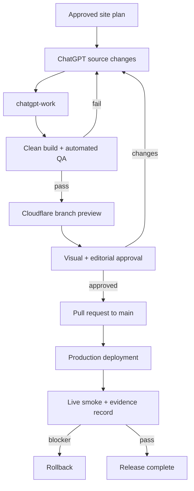

# Authority Site Pre-Publication Operating System

**Operating model:** Solo owner + ChatGPT  
**Site type:** Content-rich authority/information sites  
**Delivery route:** ChatGPT → GitHub → Cloudflare  
**Version:** 1.0, derived from the MyAxolotl retrospective through 31 August 2026

## 1. Purpose

This operating system is designed to prevent the month of reactive correction work experienced on MyAxolotl. It defines what must be decided, created, tested, approved, and recorded before an authority site reaches its production domain.

It does not promise a literally error-free website. It creates a **launch-ready, reproducible, auditable site with zero known hard blockers** and a controlled method for handling later improvements.

The system has five properties:

1. **Source-first:** durable changes are made in content, configuration, templates, components, or workflows—not in generated HTML.
2. **Contract-driven:** each page type has explicit content, media, metadata, schema, and responsive contracts.
3. **Evidence-gated:** no phase completes because work “looks done”; it completes when required artifacts and tests pass.
4. **Preview-before-production:** every release is reviewed on a Cloudflare preview URL tied to a Git commit.
5. **Regression-aware:** every change declares affected templates and proves siblings were not damaged.

## 2. Roles and decision rights

This framework assumes a small operation.

| Role | Primary responsibilities | Cannot delegate without explicit approval |
|---|---|---|
| Site owner | Business objective, audience, brand, factual accountability, risk tolerance, final launch, domain/Cloudflare ownership | Publisher identity, credentials, legal claims, final production approval |
| ChatGPT | Research organization, architecture, code, templates, build workflows, audits, QA reports, issue diagnosis, documented release preparation | Inventing credentials, accepting unresolved factual risk, silently changing scope, pushing unapproved production releases |
| Human subject reviewer, when needed | Medical/legal/financial/specialist review for high-risk content | The final expert judgment attributed to that reviewer |
| GitHub Actions | Reproducible build, automated QA, preview checks, artifact generation | Editorial judgment or approval of intentional exceptions |
| Cloudflare | Preview/production hosting, deployment history, custom domain, TLS | Deciding whether the content or UX is acceptable |

**Decision rule:** automated tests may approve objective contracts. The owner approves brand, editorial risk, intentional exceptions, and production promotion.

## 3. Repository and environment model

### 3.1 Recommended repository structure

```text
/
├── .github/
│   ├── workflows/
│   │   ├── validate.yml
│   │   ├── build-preview.yml
│   │   └── production-smoke.yml
│   ├── pull_request_template.md
│   └── CODEOWNERS
├── content/
│   ├── articles/
│   ├── hubs/
│   ├── trust/
│   └── sources/
├── data/
│   ├── page-registry.csv
│   ├── media-manifest.csv
│   ├── redirects.csv
│   ├── social-profiles.json
│   └── review-calendar.csv
├── site/
│   ├── components/
│   ├── layouts/
│   ├── styles/
│   └── assets/
├── scripts/
│   ├── build
│   ├── audit
│   ├── screenshot
│   └── smoke
├── tests/
│   ├── fixtures/
│   ├── search-intents.json
│   └── representative-pages.json
├── public/                  # generated output; never primary edit target
├── reports/                 # generated QA evidence
├── PROJECT-CHARTER.md
├── CONTENT-MODEL.md
├── DESIGN-SYSTEM.md
├── PAGE-TYPE-CONTRACTS.md
├── EDITORIAL-POLICY.md
├── RELEASE.md
├── requirements.lock or package-lock.json
└── wrangler.jsonc
```

### 3.2 Source-of-truth rule

Every published value must have one authoritative source:

| Data | Source of truth |
|---|---|
| URL, role, parent hub, primary intent | Page registry |
| Main copy, citations, dates | Content source file |
| Title/meta/canonical/schema inputs | Content front matter or page registry |
| Author/editor/publisher identity | People and organization configuration |
| Hero/card/social image mapping | Media manifest |
| Navigation and hub membership | Page registry/configuration |
| Styling and responsive rules | Component/design-system styles |
| Generated HTML, sitemap, search index | Build output only |

No value may be maintained independently in two places unless one is generated from the other and parity is tested.

### 3.3 Branch model

Use the following minimum branch convention:

- `main`: production source of truth; Cloudflare production deploys only from here.
- `chatgpt-work`: integration branch for ChatGPT-created changes and generated output.
- optional short-lived `change/<scope>` branches: one bounded change when parallel work is needed.

Do not let a bot push unreviewed changes directly to `main`.

## 4. End-to-end release flow



Every preview and production record must identify the Git SHA that created it.

## 5. The 15-phase operating system

Each phase has required outputs and a hard gate. Work may overlap, but gates must be passed in order because later decisions depend on earlier contracts.

## Phase 0 — Project charter

### Required decisions

- site name, domain, publisher, and repository;
- target audience and geography;
- primary business outcome and secondary outcomes;
- topic scope and explicit exclusions;
- site type: editorial authority, affiliate, lead generation, utility, community, or hybrid;
- risk class: ordinary, health, legal, finance, minors, regulated products, or other high-stakes topic;
- success metrics for 30, 90, and 180 days;
- budget, time, and owner availability;
- platform/runtime and Cloudflare delivery method.

### Output

`PROJECT-CHARTER.md` signed off by the owner.

### Gate G00

No unresolved contradiction between audience, business goal, scope, and risk model.

## Phase 1 — Research, entities, and evidence

### Required work

1. Collect keyword sets, questions, search results, community language, and competitor patterns.
2. Identify the central entity and its attributes, subentities, processes, comparisons, decisions, risks, and tools.
3. Separate intents: learn, compare, diagnose, decide, buy, calculate, locate, and act.
4. Record source authority and freshness requirements by claim type.
5. Mark time-sensitive claims that need launch-day verification.

### Required artifacts

- keyword and question dataset;
- entity-attribute map;
- intent-cluster map;
- source register with authority, date, and claim coverage;
- competitor coverage/gap notes;
- risk/freshness register.

### Gate G01

Every planned page must map to evidence and one primary intent. An unsupported topic does not enter the launch plan.

## Phase 2 — Topical map and page-role architecture

Create the site before writing it.

### Page registry fields

```text
url
page_type
status
parent_hub
primary_intent
primary_query
central_entity
unique_promise
required_sections
excluded_scope
prerequisites
next_action
canonical_owner
author
editor
risk_class
freshness_class
hero_asset_id
schema_types
```

### Architecture rules

- one canonical owner per intent;
- one flagship/pillar page per broad journey, not one page trying to rank for everything;
- every article belongs to a hub;
- every page states what it covers and what belongs elsewhere;
- hubs organize decisions and sequences, not just lists of cards;
- tools have prerequisite guides and action/follow-up guides;
- cross-cluster links require a named semantic relationship;
- record rejected pages/links to prevent later duplication.

### Gate G02

No unresolved cannibalization, orphan, dead-end, duplicate role, or missing user-journey step among launch pages.

## Phase 3 — Trust, publisher, and policy architecture

Create trust infrastructure before article publication.

### Minimum pages

- About;
- Editorial Policy;
- author profile(s);
- editor/reviewer profile(s);
- Contact;
- Privacy;
- Terms/disclosures as applicable;
- Corrections and update policy;
- affiliate/advertising disclosure when relevant.

### Rules

- identities and roles are stable across bylines, schema, and trust pages;
- credentials are precise and never inflated;
- AI assistance is described according to the actual workflow;
- health/legal/financial content includes appropriate educational limits and escalation paths;
- publisher and social profiles use an approved allowlist;
- verification files and special endpoints are classified as indexable, noindex, or non-content.

### Gate G03

All trust pages render and all identity/schema claims match documented reality.

## Phase 4 — Design system and accessibility contract

Freeze the system before tuning individual pages.

### Required artifacts

- color, typography, spacing, radius, shadow, width, and breakpoint tokens;
- light/dark behavior if supported;
- component inventory;
- header/nav/footer behavior;
- focus, hover, active, error, empty, and loading states;
- accessibility baseline: keyboard, landmarks, contrast, labels, focus visibility, reduced motion;
- screenshot reference for each page type at phone, tablet, laptop, and wide desktop.

### Regression rule

CSS must be scoped by component or page family. A global selector change requires screenshots for all templates that consume it.

### Gate G04

Every page type passes responsive and accessibility review with real content and real media, not placeholders.

## Phase 5 — Page-type contracts

Define a contract for each template before mass generation.

| Page type | Required content | Required metadata/schema | Required visual behavior |
|---|---|---|---|
| Homepage | value proposition, Start Here, topic navigation, trust summary, tools/next actions | WebSite + Organization, canonical, OG/X | approved hero; no unbalanced grids; complete mobile nav |
| Hub | unique introduction, sequence/decision guidance, child-page cards, cross-hub handoffs | CollectionPage/Breadcrumb as appropriate | cards use declared media policy; no wrong/cropped labels |
| Article | direct answer, scoped sections, evidence, author/editor, update date, related journey | Article + Breadcrumb; FAQ only when visible | natural hero contract; readable tables; no overflow |
| Tool | purpose, inputs, output explanation, limits, safety, supporting guides | WebApplication/SoftwareApplication as appropriate + Breadcrumb | keyboard usable; mobile inputs; error/empty states |
| Trust | accurate identity/policy/contact information | AboutPage/ProfilePage/Person/Organization as appropriate | consistent brand and readable long-form policy |
| Search | query input, useful results, empty state, safety routing | SearchAction where valid | no irrelevant hijacks; accessible result focus |
| Utility | explicit indexability classification | minimal appropriate metadata | no accidental entry into content templates |

### Gate

Build one representative page per type and approve it before generating the rest.

## Phase 6 — Content production system

### Content brief template

```markdown
# Page brief
- URL:
- Page type:
- Parent hub:
- Primary intent/query:
- Unique promise:
- Audience state:
- Direct answer:
- Required entities/attributes:
- Required sections:
- Excluded scope and canonical destination:
- Prerequisite links:
- Next-action links:
- Evidence/source requirements:
- Risk and caution requirements:
- Freshness/review interval:
- Image concept and factual labels:
- Metadata intent:
- Acceptance tests:
```

### Editorial rules

- answer the primary intent early;
- use headings that represent real subquestions or processes;
- distinguish observation from diagnosis and fact from inference;
- attach high-risk claims to current authoritative sources;
- retain source provenance and last-verified date;
- do not pad or trim only to hit a word-count target;
- do not expose prompts, editorial notes, internal status, or conversion tokens;
- dates are editorial data, not build timestamps;
- a visible FAQ must be a real question-and-answer section before receiving FAQ schema.

### Content Definition of Done

No draft enters the build unless its page role, evidence, exclusions, handoffs, byline, review status, date, and media concept are complete.

## Phase 7 — Media system

Media is page data, not a late decoration pass.

### Media manifest fields

```text
asset_id
page_url
role                # article-hero, hub-card, social, inline, logo, favicon
source_file
output_file
checksum
width
height
ratio
format
byte_size
alt
caption
description
credit
rights_status
focal_point
crop_policy
approved
```

### Default authority-site hero contract

- 1600×900 (16:9) unless the template contract declares another size;
- local WebP/AVIF output with explicit width and height;
- unique, page-relevant visual—not a generic animal/person reused across unrelated pages;
- 3–4 concise information points for infographics;
- important text and subjects kept inside safe margins;
- consistent small brand mark when desired;
- factual labels supported by page text;
- meaningful alt text describes the image’s purpose, not keyword stuffing;
- caption/description/credit recorded when applicable.

### Automated media tests

- every registry page has the required role asset;
- every referenced file exists and decodes;
- dimensions and declared ratio match;
- filenames contain no `placeholder`, random export ID, or unapproved generic name;
- page→asset mapping is one-to-one unless reuse is explicitly approved;
- checksum catches accidental duplicates;
- byte-size budget passes;
- local URLs only—no fragile hotlinks;
- card and hero screenshots detect crop, letterbox, overflow, and unreadable text;
- OG/X image URL is absolute and returns 200.

### Gate G06

No page can launch with missing, wrong, placeholder, unapproved, or visibly damaged media.

## Phase 8 — Semantic linking, navigation, onsite search, and tools

### Link graph requirements

- article→parent hub;
- parent hub→article;
- article→prerequisite and next action where useful;
- tool→supporting guide and guide→tool;
- cross-cluster link only with recorded relationship;
- no unexplained zero-outbound content pages;
- no broken internal URL;
- no duplicate same-destination body links without reason;
- hubs intentionally filtered from graph metrics are documented rather than falsely “fixed.”

### Search requirements

Create a fixture file containing:

- exact canonical queries;
- synonyms and natural-language variants;
- common typos;
- commercial queries;
- urgent/safety queries;
- ambiguous queries;
- must-rank route;
- must-not-rank routes;
- tool-action expectations.

Search fixes must preserve precedence: a specific intent owner beats a generic hub; a safety route beats entertainment content; an urgent route must not hijack an unrelated setup query.

### Tool requirements

- formula/logic is documented and tested;
- input bounds and units are explicit;
- keyboard and mobile use pass;
- errors, impossible values, and empty state are handled;
- results explain limits and next actions;
- high-risk tools avoid diagnosis and include escalation guidance;
- canonical, description, OG/X, breadcrumb, and relevant application schema are present.

## Phase 9 — Technical SEO and structured data

### Central metadata API

Every page type must produce from one shared system:

- `<title>`;
- meta description;
- canonical;
- robots directive;
- Open Graph title, description, type, URL, site name, and image;
- X/Twitter card, title, description, image, site, and creator where used;
- favicon and site identity;
- JSON-LD appropriate to the page type.

### Required validations

- one nonempty title and one meta description;
- one canonical, absolute and self-consistent;
- one H1 with logical headings;
- unique titles/descriptions or documented exception;
- no clipping artifact such as an ellipsis inserted into source metadata;
- OG/X title-description-image parity unless intentionally different;
- absolute social-image URLs returning 200;
- Article/Person/Organization identity parity;
- BreadcrumbList coverage for all hierarchical page families;
- FAQPage only when visible FAQ content exactly supports it;
- sitemap contains all and only intended indexable URLs;
- robots does not block required assets/content;
- verification and noindex utilities are excluded appropriately.

### Gate G07

Zero critical metadata, canonical, robots, sitemap, schema, or indexability failures. Length warnings require manual review, not bulk rewriting.

## Phase 10 — Build system and CI

### Reproducibility rules

- build succeeds from a clean clone;
- all dependencies are locked;
- all required source locations are declared;
- no absolute developer-machine paths;
- build does not require an interactive GUI;
- identical source produces functionally equivalent output;
- build does not invent publication dates;
- generated output is deterministic enough to review;
- build fails on missing media/source rather than silently using a generic fallback for a flagship page.

### Forbidden-output scan

Scan the complete generated tree and search index for:

```text
TODO
PLACEHOLDER
<UL_
<OL_
EDITOR NOTE
INTERNAL ONLY
undefined
localhost
file://
C:\Users\
unresolved template delimiters
```

Maintain project-specific patterns as defects are discovered.

### CI workflow stages

1. checkout with full enough history for comparisons;
2. install locked dependencies;
3. build;
4. run unit/functional tests;
5. validate HTML, links, metadata, schema, sitemap, and search index;
6. run media audit;
7. run secret scan and external-script inventory;
8. render representative screenshots;
9. compare unexpected diff paths;
10. publish preview artifact only if all hard checks pass.

### Concurrency and loop protection

- one concurrency group per branch/environment;
- cancel stale in-progress preview builds when newer commits arrive;
- generated-output commits carry a skip marker to prevent infinite build loops;
- only the intended branch is writable by the build bot;
- bot commits never bypass protected production review.

## Phase 11 — Automated and visual QA

### Representative-page matrix

At minimum test:

- homepage;
- largest hub;
- smallest hub;
- flagship article;
- long article with tables/lists;
- article with FAQ;
- article without FAQ;
- each tool;
- search page;
- About/editorial/author/editor pages;
- 404;
- one page from each media exception family.

### Viewports

- 360×800 phone;
- 768×1024 tablet;
- 1366×768 laptop;
- 1920×1080 wide desktop;
- dark mode when supported.

### Visual failure classes

- crop or letterbox damage;
- wrong image/page combination;
- clipped labels or focal subject;
- horizontal overflow;
- unbalanced grids or excessive blank space;
- mobile navigation failure;
- table/code overflow;
- unreadable contrast;
- layout shift from missing dimensions;
- footer/header inconsistency;
- content hidden behind sticky elements.

### Regression matrix

Every PR lists affected component/template families. CI re-screens those families plus one unaffected control family. A fix to Diet-card images, for example, must prove article heroes and other hubs remain unchanged.

## Phase 12 — Security, privacy, and operational readiness

### Required checks

- repository secret scan;
- no credentials in generated HTML or client JavaScript;
- form destinations and spam protection verified;
- third-party scripts, cookies, analytics, embeds, and fonts inventoried;
- privacy/consent behavior matches actual collection;
- dependency vulnerability review;
- secure HTTPS endpoints only;
- Cloudflare security headers appropriate to the site;
- backup/export of source and configuration;
- domain renewal, GitHub, and Cloudflare ownership recorded;
- rollback procedure documented.

### Gate G11/G14

No exposed secret, unapproved data collection, insecure endpoint, or unowned critical account. A previous known-good release can be restored.

## Phase 13 — Cloudflare preview and owner acceptance

### Preview protocol

1. Push bounded changes to `chatgpt-work`.
2. Wait for the latest build; stale runs must cancel.
3. Confirm the source diff contains only expected files.
4. Confirm generated diff matches the declared scope.
5. Open the Cloudflare branch preview tied to the candidate SHA.
6. Run automated remote checks against the preview.
7. Complete visual matrix and content spot checks.
8. Record intentional exceptions with owner approval.
9. Open a pull request to `main` with evidence links.

### Pull-request evidence template

```markdown
## Purpose

## Source changes

## Generated changes

## Page/template families affected

## Expected paths

## Risks and intentional exceptions

## Automated checks
- Build:
- Links/canonicals/sitemap:
- Metadata/schema:
- Media:
- Search/tools:
- Security:

## Preview
- Git SHA:
- Cloudflare URL:
- Representative pages checked:
- Viewports checked:

## Rollback
- Previous production SHA/deployment:
```

### Gate G12

All CI checks are green, only expected differences exist, the preview is approved, and no hard exception is open.

## Phase 14 — Production promotion and live verification

Merge the approved pull request to `main`; let Cloudflare deploy that exact commit.

### Live checks

- GitHub `main` SHA recorded;
- Cloudflare deployment ID/URL recorded;
- custom domain resolves to the deployment;
- HTTPS valid;
- homepage returns 200;
- one representative URL for every page type returns 200;
- flagship and high-risk pages return 200;
- robots and sitemap accessible;
- sitemap URLs resolve and canonicalize correctly;
- structured data spot checks pass on live HTML;
- OG/X image URLs return 200;
- onsite search/tool smoke tests pass against production;
- analytics/Search Console verification present if part of the launch plan;
- no unexpected noindex, redirect loop, mixed content, or console error.

### Gate G13

The public site matches the approved candidate. If any hard check fails, rollback first and diagnose second unless the failure is proven non-user-facing and the owner explicitly accepts it.

## Phase 15 — Postlaunch change control

The production launch closes the project’s build phase, not its quality discipline.

### Change classes

| Class | Example | Required path |
|---|---|---|
| A — content correction | typo, factual clarification, source update | source edit → focused build → page QA → preview → production |
| B — media replacement | hero/card/social asset | manifest edit → media audit → sibling visual regression → preview |
| C — template/style | card ratio, nav, typography | full affected-template screenshots + control templates |
| D — architecture | new hub/page, URL, redirect, page-role change | topical/cannibalization review + link graph + full SEO QA |
| E — build/deploy | workflow, dependencies, generator | clean-clone build + full regression + rollback proof |
| F — high-risk factual | health/legal/finance/safety | current-authority verification + editorial approval + dated evidence |

### Required postlaunch records

- issue register with symptom, impact, root cause, fix, test, and prevention;
- release log tied to Git SHA and Cloudflare deployment;
- review calendar for time-sensitive pages;
- redirect ledger;
- known-exception register with owner and expiry date.

## 6. Hard launch gates

The companion CSV contains operational rows. These rules override any aggregate score.

### Automatic STOP conditions

Do not launch when any of the following is true:

- unresolved site scope or canonical page-role conflict;
- missing publisher/trust identity;
- unreviewed high-risk claims;
- build cannot run from declared sources;
- missing dependency, secret, or deployment ownership;
- broken internal link on a launch journey;
- missing/incorrect canonical, robots, or sitemap behavior;
- missing or mismatched required structured data;
- placeholder/editorial/conversion token in output;
- missing, wrong, or damaged hero on a launch page;
- failed mobile navigation or critical tool workflow;
- preview not tied to the candidate SHA;
- production domain/HTTPS/live routes unverified;
- rollback unavailable.

### Warning conditions

These require review but do not automatically block:

- unusual title or meta length without truncation/error;
- unusually short or long content with a legitimate page role;
- no FAQ schema on a page that does not contain a real visible FAQ;
- intentional nav/footer-only hubs filtered from semantic graph metrics;
- approved media ratio exceptions.

## 7. Automated QA specification

The next starter repository should expose one command, for example `./scripts/audit all`, that creates a machine-readable and human-readable report.

| Test family | Required assertions |
|---|---|
| Inventory | registry, build output, sitemap, and search index counts reconcile; utility/noindex exceptions documented |
| HTML | parseable output; one title; one H1; logical headings; no forbidden tokens |
| URLs | internal links resolve; redirects intentional; canonical unique; no mixed slash policy |
| Metadata | required tags present; unique where needed; no truncation artifacts; OG/X parity |
| Schema | valid JSON; page-type coverage; identity parity; FAQ-visible parity; breadcrumbs |
| Media | file exists/decodes; mapping correct; dimensions/ratio/size; alt; local URL; no placeholder/duplicate |
| Semantics | no unexplained orphan/dead end; purposeful cross-cluster edges; duplicate-link scan |
| Search | all must-rank/must-not-rank fixtures; typos; urgent; commercial; ambiguous; no hijacks |
| Tools | calculations, bounds, units, errors, mobile, keyboard, descriptions, safety paths |
| Accessibility | landmarks, labels, alt, focus, keyboard, contrast, reduced-motion basics |
| Performance | asset budgets, compression, lazy loading below fold, dimensions, no excessive blocking assets |
| Security | secrets, insecure URLs, unexpected external scripts, dependency scan |
| Deployment | preview/live SHA, 200 checks, HTTPS, robots/sitemap, social images, representative pages |

Every test report includes: timestamp, Git SHA, environment, inventory counts, failures, warnings, approved exceptions, and exact reproduction command.

## 8. Site-wide Definition of Done

A future authority site is ready for production only when:

1. project charter, research, topical map, and page registry are approved;
2. every indexable page has a unique role, parent, intent, and next action;
3. publisher, author/editor, and policies are accurate and live;
4. one representative of every page type has been approved before bulk generation;
5. all planned content is final, sourced, dated, reviewed, and free of internal artifacts;
6. every media mapping is final, optimized, accessible, and visually verified;
7. metadata, schema, sitemap, robots, canonicals, and social cards pass centrally;
8. semantic graph, tools, onsite search, accessibility, and safety fixtures pass;
9. the build succeeds from a clean declared environment;
10. GitHub checks, Cloudflare preview, responsive screenshots, and owner acceptance pass;
11. production promotion, live checks, and rollback evidence pass;
12. no hard gate remains open.

## 9. ChatGPT working protocol

Use these rules in every future site conversation:

1. Begin by reading the charter, page registry, contracts, and current Git status.
2. State the bounded change, affected page types, and expected files before editing.
3. Modify source-of-truth files only.
4. Keep unrelated user changes untouched.
5. Build and run the smallest relevant tests, then the required regression matrix.
6. Inspect the rendered page, not only code.
7. Report exact failures; do not claim success when a deployment or live state is unverified.
8. Commit one coherent concern with a descriptive message.
9. Wait for the latest CI run and reject stale output.
10. Promote only after preview evidence and owner approval.

## 10. Prompt pack

### 10.1 New-site architecture prompt

```text
Using the approved project charter and research files, create a topical map and page registry for an authority site. Assign exactly one primary intent and canonical owner to every URL. For each page record its page type, parent hub, unique promise, excluded scope, prerequisite pages, next action, risk class, freshness class, schema types, and media role. Identify cannibalization, missing journey steps, and unsupported pages. Do not draft content until Gate G02 passes.
```

### 10.2 Page brief prompt

```text
Create the page brief for [URL] from the approved registry. Preserve its primary intent and excluded scope. Specify the direct answer, required entities and sections, evidence needed for each high-risk claim, prerequisite and next-action links, visible FAQ decision, image concept, metadata intent, and acceptance tests. Flag any conflict with sibling pages instead of broadening the page.
```

### 10.3 Content QA prompt

```text
Audit this draft against its approved page brief and source register. Check intent completion, factual support, cautious language, role boundaries, heading logic, internal handoffs, author/editor/date data, visible FAQ/schema eligibility, and leaked editorial or conversion tokens. Return blocking defects separately from manual-review warnings. Do not rewrite merely to meet a word-count or metadata-length target.
```

### 10.4 Media batch prompt

```text
For the supplied page registry rows, create or import page-specific images that conform to the media contract. Produce a manifest row for every asset with unique mapping, filename, checksum, dimensions, ratio, alt, caption, description, credit, rights status, focal point, crop policy, and approval state. Preserve protected flagship assets. Stop on duplicate or ambiguous page mapping.
```

### 10.5 Prelaunch audit prompt

```text
Run the complete prelaunch audit against a clean build. Reconcile page registry, output, sitemap, and search index; validate HTML, links, metadata, canonicals, robots, schema, media, semantic graph, onsite search, tools, accessibility, performance budgets, secrets, and representative screenshots. Apply hard STOP rules. Produce machine-readable results and a human launch decision with exact evidence.
```

### 10.6 Scoped fix prompt

```text
Diagnose [symptom] without editing first. Identify the source-of-truth file, affected template families, regression risk, and expected files. After approval, implement the smallest source-level fix, rebuild, run affected-family screenshots plus one control family, verify the preview, and report the exact Git SHA and evidence. Do not edit generated HTML as the durable fix.
```

### 10.7 Release prompt

```text
Prepare the candidate on chatgpt-work. Confirm only expected source and generated changes, run all hard QA gates, verify the Cloudflare preview tied to the candidate SHA, and produce the pull-request evidence template. Do not merge or promote to production until the owner approves the preview and no hard blocker remains.
```

### 10.8 Live verification prompt

```text
Verify the production release end to end. Record the main SHA and Cloudflare deployment, confirm domain and HTTPS, check representative URLs for every page type, robots, sitemap, canonicals, structured data, social images, search, tools, and console errors. If a hard check fails, recommend rollback to the recorded previous deployment before further changes.
```

## 11. Minimum reusable starter kit for the next site

Before beginning the next authority site, create these files in the new repository:

1. `PROJECT-CHARTER.md`
2. `data/page-registry.csv`
3. `data/media-manifest.csv`
4. `data/source-register.csv`
5. `PAGE-TYPE-CONTRACTS.md`
6. `DESIGN-SYSTEM.md`
7. `EDITORIAL-POLICY.md`
8. `tests/representative-pages.json`
9. `tests/search-intents.json`
10. `scripts/audit` with the QA families in this document
11. GitHub validation and preview workflows
12. `RELEASE.md` with promotion and rollback procedures
13. the companion `authority-site-launch-gates.csv`

Do not begin bulk content or image production until items 1–7 exist and Gates G00–G04 pass.

## 12. Recommended improvements over the MyAxolotl route

1. **Keep content source inside the repository.** This removes dependence on a powered-on Windows self-hosted runner and external DOCX directory. If source must remain external, install the runner as a managed service and monitor it.
2. **Use Cloudflare branch previews from day one.** The custom domain should never be the first place a layout or image batch is reviewed.
3. **Protect `main`.** Require pull request, passing checks, and owner approval.
4. **Do not have CI commit broad generated output unless necessary.** Prefer a deployment artifact built from the source commit; if generated output is versioned, isolate bot commits and compare source↔generated provenance.
5. **Add visual regression fixtures early.** MyAxolotl’s most visible late issues—Start Here spacing, hero crop, Diet card letterbox, wrong image—would have been caught before production.
6. **Make the page and media registries first-class.** They prevent wrong images, accidental overwrites, role drift, and hidden exceptions.
7. **Treat the final audit as a launch prerequisite.** The Phase 10–12 style reports belong in the starter kit, not the repair phase.

## 13. Launch decision record

Use this final record for every production release:

```markdown
# Production launch decision
- Site:
- Date/time:
- Owner approver:
- Candidate Git SHA:
- Previous production SHA:
- Cloudflare preview URL:
- Cloudflare production deployment:
- Page inventory:
- Hard gates: PASS / FAIL
- Warnings accepted:
- Known exceptions and expiry:
- Rollback target:
- Live verification report:
- Decision: LAUNCH / STOP / ROLLBACK
```

The decision is **STOP** whenever any hard gate fails, regardless of schedule pressure or aggregate QA score.

## 14. How this framework should evolve

After each future site or incident:

1. add the symptom and root cause to the retrospective register;
2. convert it into a contract, automated test, visual fixture, or explicit manual gate;
3. add the test to the starter repository;
4. rerun it against existing representative sites;
5. version this operating system.

That converts mistakes into permanent organizational capability instead of repeating the same correction month on the next site.
